# Atom MIC  
## M5Stack Atomシリーズ（ECHO,Uを除く）専用のマイク基板です  
・取り付けることによりPDMマイクの利用が可能です  
・PDMマイクは[Knowles](https://www.ja.knowles.com/)社の[SPH0641LM4H-1](https://www.knowles.com/docs/default-source/default-document-library/sph0641lm4h-1-datasheet-rev-f.pdf)を利用しています  
・Groveコネクタを1つ増設することもできます (J5)  
・各信号ピンはさらに別へも接続できるように端子が設けられています(J3,J4)  
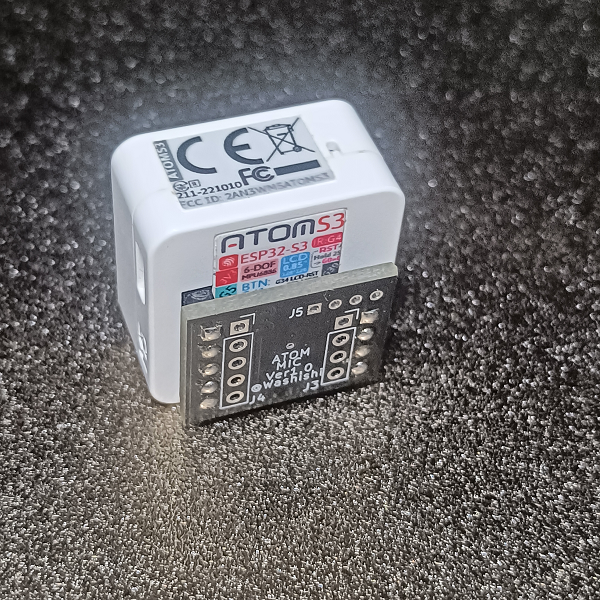
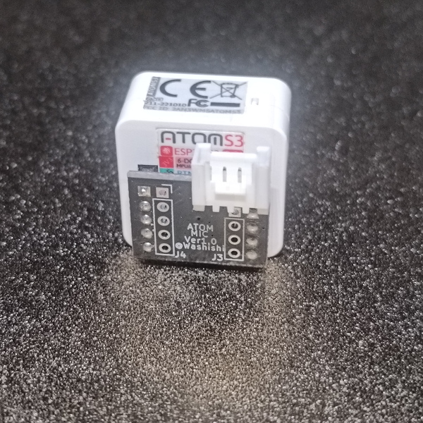 
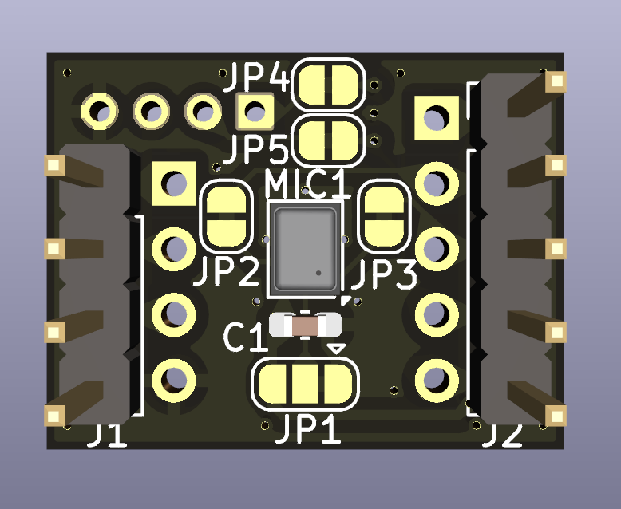
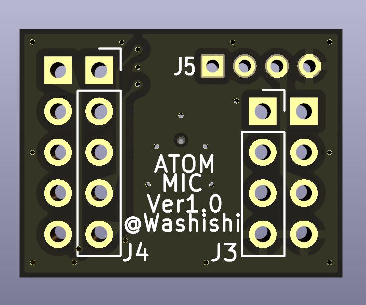 
### なお本基板は完成品(Groveコネクタは未実装で添付)をBOOTH[ わしししょっぷ ](https://washishi.booth.pm/)で頒布もしております [Atom MIC](https://washishi.booth.pm/items/6182811)
 

# ソフトウエアでの利用について
接続先GPIOが異なる以外は M5Stackの[PDMマイクユニット](https://docs.m5stack.com/ja/unit/pdm)と同等に利用できます

# 使用するGPIO
マイク等の接続先は下記となります　(※マイクの接続先はAtomECHOとは異なります)  
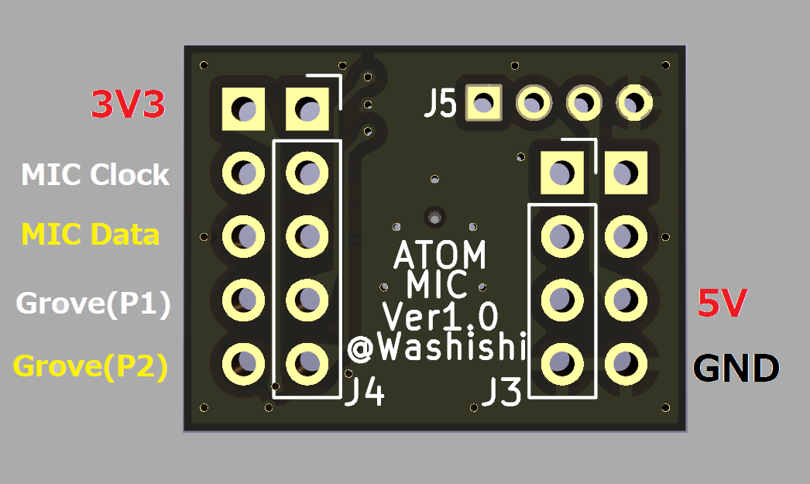
|Atom種別|MIC Clock|MIC Data|Grove PIN1|Grove PIN2|Grove PIN3|Grove PIN4|
|:--|:-:|:-:|:-:|:-:|:-:|:-:|  
|AtomS3/S3Lite/S3R/S3RCAM/S3RExt|G5|G6|G7|G8|+5V|GND|
|Atom/Atom Lite/Atom Matrix|G22|G19|G23|G33|+5V|GND|
||

また各ピンの隣のランド(J3,J4)はそれぞれ同じピンに接続されていますので  
さらに別へ接続したい場合や接続先ピンの変更等に利用できます  
# 接続先ピン変更、マイクデータのタイミング変更について
JP1のパターンカットおよび接続変更によりPDMマイクのデータタイミングの変更ができます  
(元々PDMマイクは同じバス上にデータタイミングの異なる2つのマイクが接続できる仕様となっています)  
また各接続先はJP2～JP5のパターンカットにより切り離せるようになっており  
切り離して下図の赤色側のランドをUEW線等で別のピンに繋ぐことにより接続先を変更することができます  
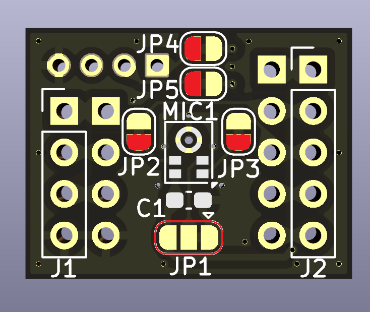
|JP|用途|説明|
|:--|-|:--|  
|JP1|マイク Select|デフォルトは中央の端子がGND(▽側)に繋がっていますがパターンカットして反対側(3V3)に繋ぐことによりデータタイミングが変わります|  
|JP2|マイク Clock|PDMマイクのClockピンへの接続|  
|JP3|マイク Data |PDMマイクのDataピンへの接続|   
|JP4|Grove PIN1 |Groveコネクタ(J5)のPIN1(白)への接続|    
|JP5|Grove PIN2 |Groveコネクタ(J5)のPIN2(黄)への接続|    

# 回路図
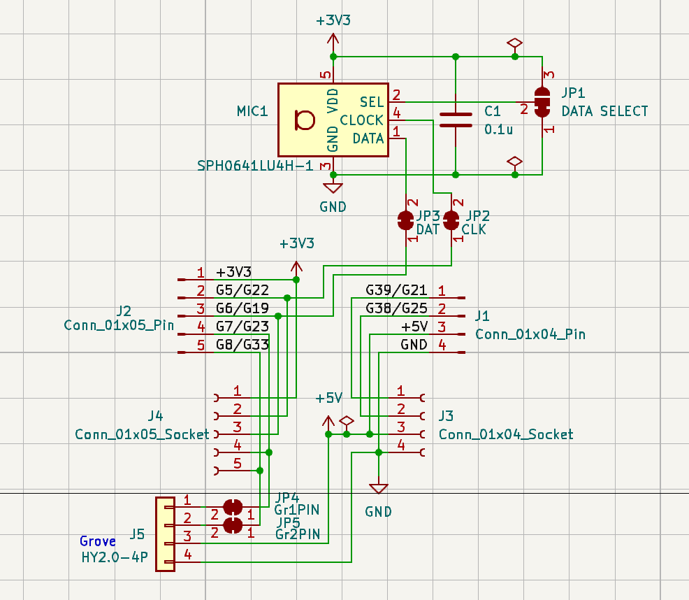 
本リポジトリ schematics の下に KiCad(Ver7)で作成したデータ一式があります

# BOM(部品リスト)
|名称|仕様|メーカー|個数|備考|備考購入先|  
|:--|:-:|:-:|:-:|:-:|:-:|  
|基板|Atom MIC基板|-|1||[JLCPCB](https://jlcpcb.com/JPV)へ発注|
|PDMマイク|SPH0641LM4H-1|Knowles|1||[マルツ](https://www.marutsu.co.jp/pc/i/46506093/)(DigiKey在庫品)|  
|チップ積層セラミックコンデンサ|0.1uF 1608サイズ|-|1||[秋月電子](https://akizukidenshi.com/catalog/g/g113071/)100個セット|
|ピンヘッダ|2.54mm 1x40 ロープロファイル(9.54mm)|-|1||[秋月電子](https://akizukidenshi.com/catalog/g/g100171/)|
|Groveコネクタ|HY2.0-4P L形|-|1|Groveポートをつける場合|[秋月電子](https://akizukidenshi.com/catalog/g/g112634/)10個セット|

## 部品について
- 基板  
  本リポジトリの schematics\production に JLCPCB 向けのガーバデータがあるのでそれを利用して発注してください  
  - atom-mic.zip : 1枚のデータ (JLCPCBでは$2(送料別)で5枚の基板が作れます)  
  - atom-mic_x30.zip : 5x6の面付けデータ (JLCPCBでは$7.9(送料別)で150枚の基板が作れます)
- PDMマイク  
[SPH0641LM4H-1](https://www.knowles.com/docs/default-source/default-document-library/sph0641lm4h-1-datasheet-rev-f.pdf) を利用しています 
Degikey等で扱っていますが直接だと少量の購入では送料の方がかなり高くなると思います  
[マルツの通販](https://www.marutsu.co.jp/)でDegikey取り扱い品も注文出来てかつマルツ取扱製品も含めトータル3000円以上だと送料が無料になるので他に欲しい物と合わせて購入するとお得です。また店舗引き取りも利用可能な様です(この場合は少額でも送料無料)  
SPH0641LM4H-1の代わりに上位版の超音波まで対応できる [SPH0641LU4H-1](https://www.knowles.com/docs/default-source/model-downloads/sph0641lu4h-1-revb.pdf?Status=Master&sfvrsn=bdc077b1_4) でも利用可能です  
(こちらは[秋月電子で扱っている](https://akizukidenshi.com/catalog/g/g114730/)のですが現在は通販のみ・在庫限り・1回での購入制限1個で終売になる様です)
- チップ積層セラミックコンデンサ  
1608サイズの 0.1uF であればなんでもかまいません 耐圧は電源が3.3Vなので気にしなくてもいいと思います
- ピンヘッダ  
折って基板1枚当たり 4Pin x 1、5Pin x1 を使います  
Atomに刺した際にピン部分が余らない様にロープロファイルの物を利用しており秋月電子等で購入可能ですが  
普通のピンヘッダをラジオペンチ等で挟んで少しAtomの刺さる側を短くしてもいいと思います  
(基板側はピンを切るので長くなっても問題ないです)
- Groveコネクタ (オプション)  
  Groveポートを増やしたい場合はL形の物を準備してください

# 制作について
- マイク  
  背面にしか端子のないチップ部品の為リフローする必要がある為ヒートテーブルやクリームはんだが必要です  
  また非常に熱に弱いためクリームはんだは低温(138℃)で溶けるものを利用し短時間で済ませて下さい
- チップ積層セラミックコンデンサ  
  極性はありません 手はんだも可能ですがマイクと一緒にリフローして取り付けるといいと思います
- ピンヘッダ  
  Atomに刺すため折って 1つ当たり 4Pin x 1、5Pin x1 を準備してください  
  ロープロファイルの物が準備できない場合はそのままだと奥まで刺さらず隙間ができます(写真1枚目)  
  その場合はラジオペンチ等で挟んで刺した際にピン部分が余らない様にピンを移動してください(写真2枚目)  
  ピンが奥まで刺さった状態(写真3枚目)  
  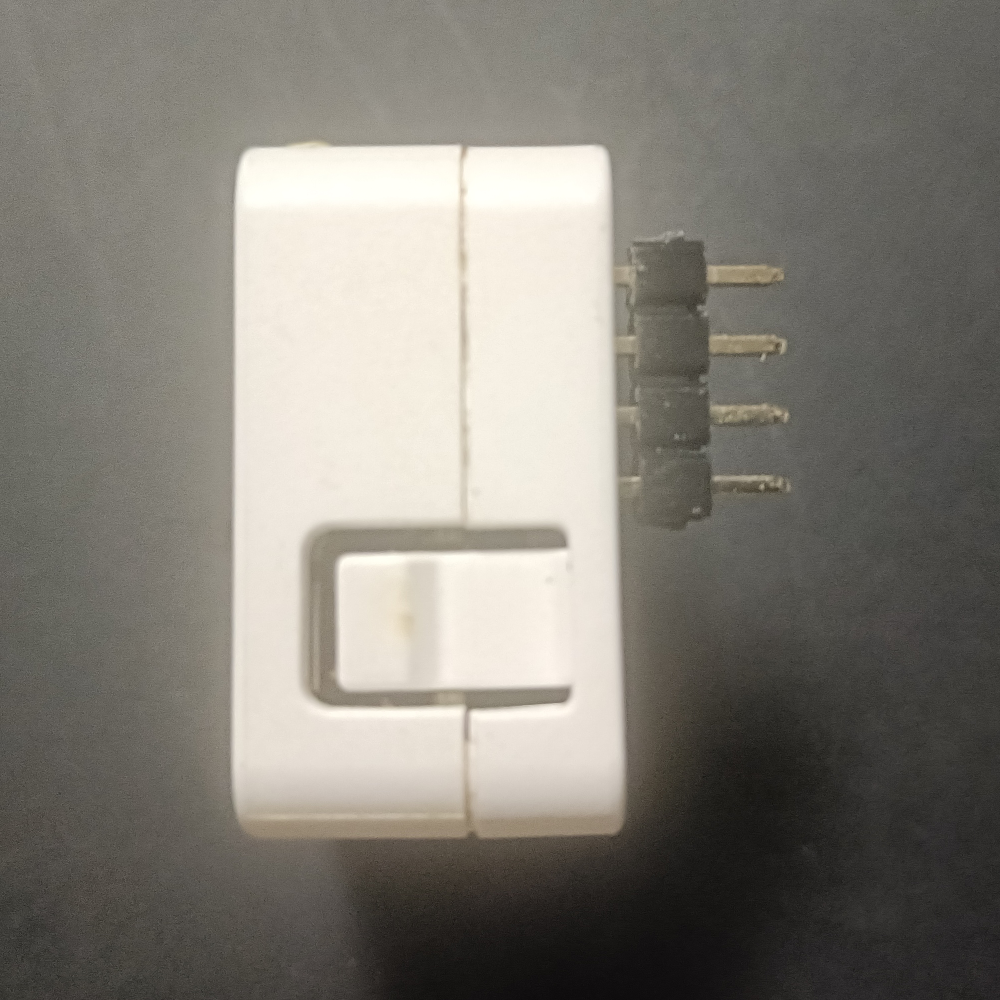
  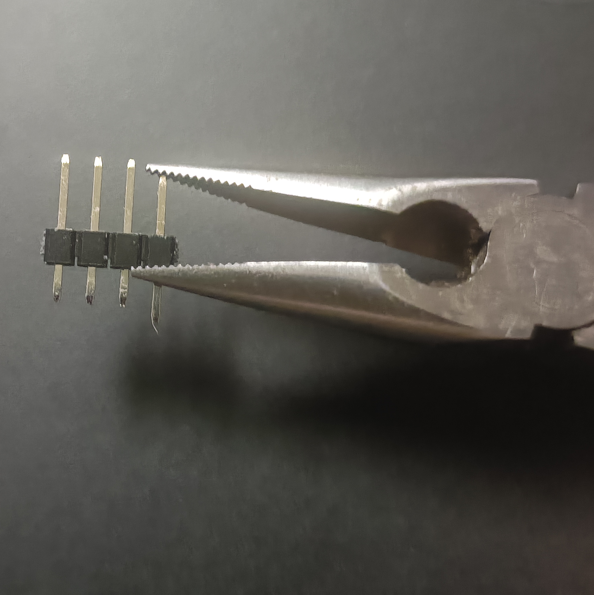
  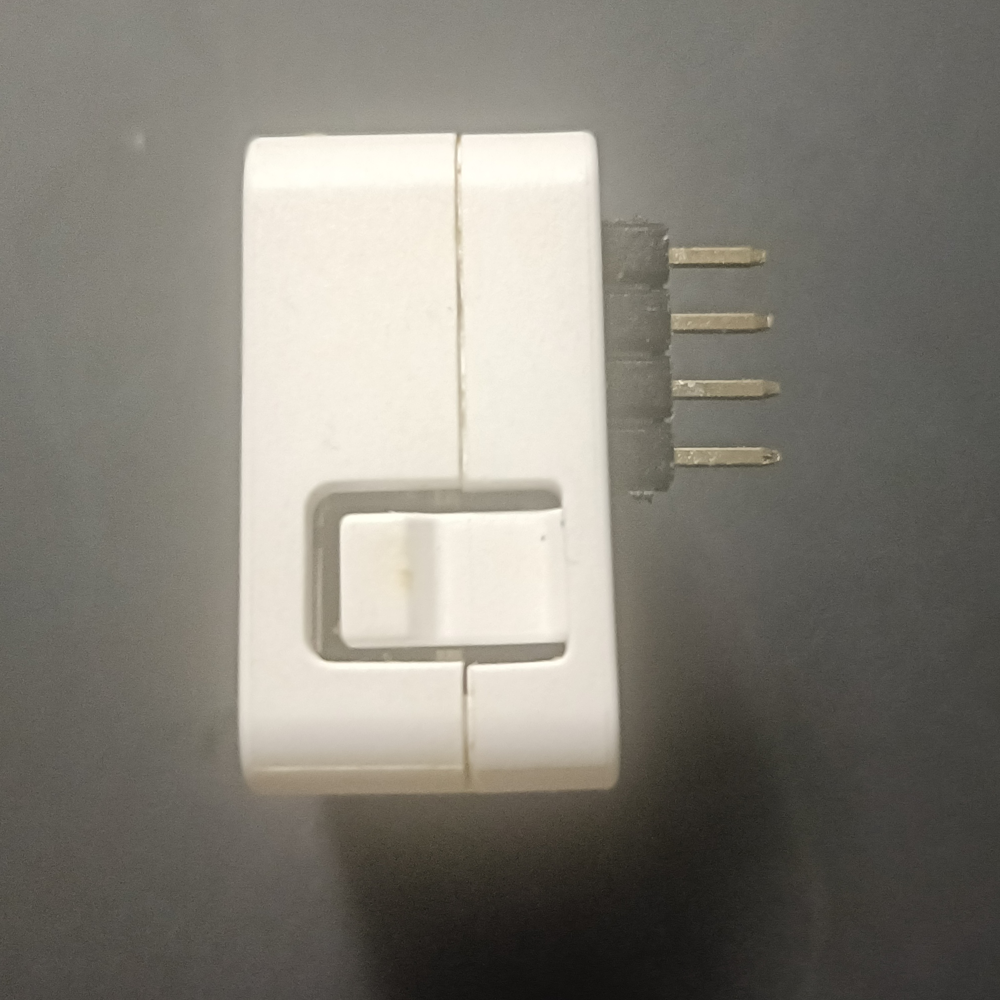 
  その後2つともAtomに刺して基板を載せて余ったピンをニッパーで切断します(写真1枚目) ※切ったピンが飛ぶので注意  
  全てのピンの余分部分を切った状態(写真2枚目)  
  この状態ではんだ付けを行います (スルーホールにしっかりはんだが流れ込むように)     
   ※あまり長時間ハンダゴテを当てるとAtomが壊れることがあるかもしれないので注意  
  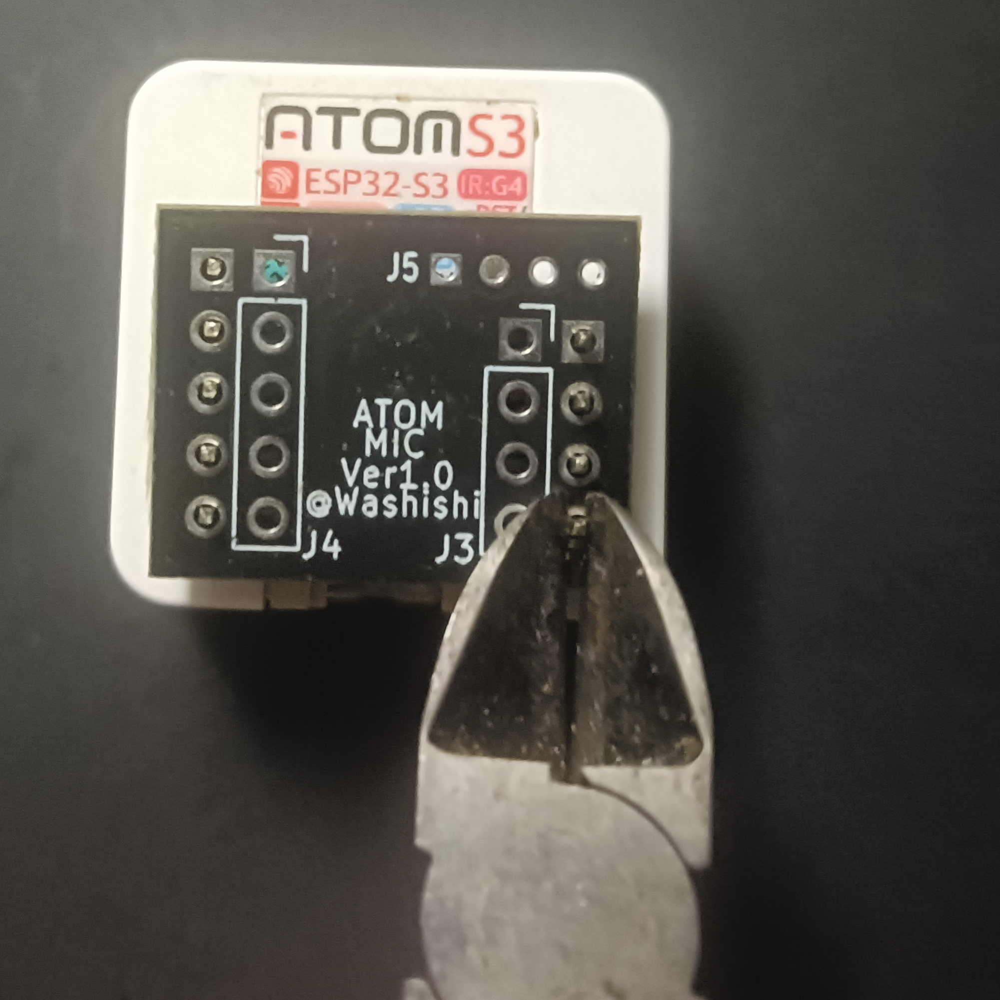
  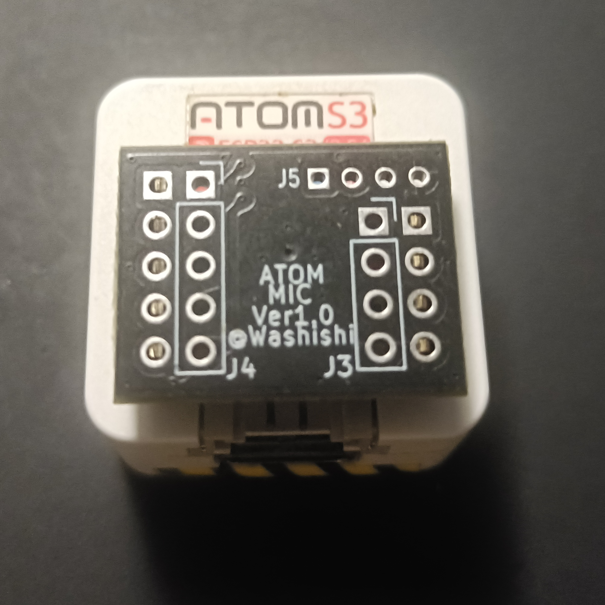 
- Groveコネクタ (オプション：取り付けると出っ張る為お好みで)  
  使う場合は写真の向きではんだ付けします  
  ピンの余った部分を切る場合ははんだ付け前に切って下さい (干渉しないのでそのままでもかまいません)  
  
   
